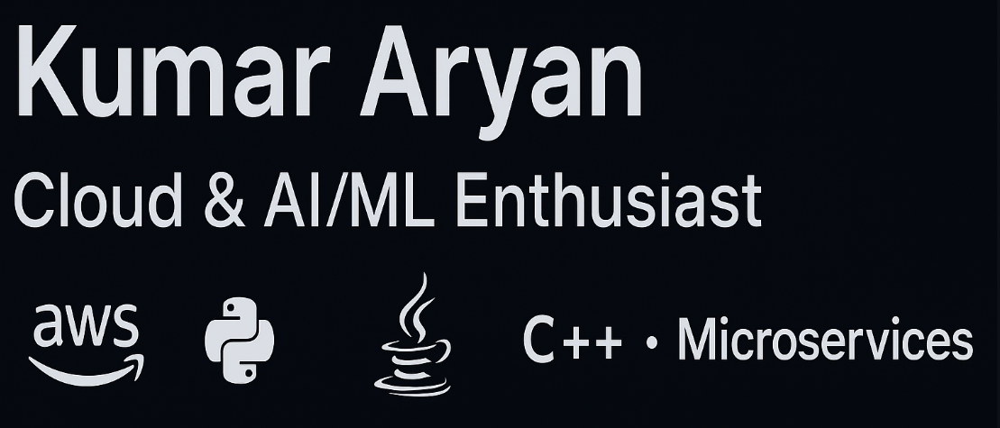

  

<h1 align="center">Hi 👋, I'm Kumar Aryan</h1>
<h3 align="center">Cloud & AI/ML Enthusiast | 2nd Year BE Student | C++ • Java • Python</h3>

---

### 🚀 About Me
- 🎓 I'm a **2nd-year BE student** passionate about **Cloud Computing** and **AI/ML**
- ☁️ Strong interest in cloud architecture, serverless computing, and scalable systems  
- 🤖 I also enjoy training ML models and experimenting with datasets  
- 💻 Comfortable with **C++**, **Java**, and **Python**  
- 🌩 Familiar with **AWS services** and **microservices architecture**  
- 🌱 Currently learning **Spring Boot** and improving my understanding of **PyTorch**  
- 🔍 Always exploring new tech in cloud, backend, and machine learning

---

### 🧠 **Skills & Tech Stack**

#### 🗣 Programming Languages  
- **C++**, **Java**, **Python**

#### ☁️ Cloud & Backend  
- **AWS Fundamentals** (EC2, S3, IAM, Lambda basics)  
- **Microservices Concepts**  
- **Serverless basics**  
- **Spring Boot (beginner)**  
- REST API development (learning)

#### 🤖 AI / ML  
- Model training on datasets  
- Basic **PyTorch** experience  
- Data preprocessing & ML workflows  

#### 🛠 Tools & Other Technologies  
- Git & GitHub  
- SQLite / MySQL basics  
- VS Code / IntelliJ / Jupyter Notebook  

---

## 📌 Featured Projects

#### ☁️ **SmartHealthcareDBMS** — C++ & SQLite  
A healthcare prediction system that analyzes symptoms, stores patient data, and predicts diseases using a custom query engine.

#### 📰 **News Summarizer** — Python, Streamlit  
AI-powered app using DistilBART to summarize news articles instantly with adjustable length.

---

### 📊 GitHub Stats

  
  

---

### 🎯 Current Goals
- Deepen knowledge of **AWS & Cloud Architecture**  
- Build **cloud-native projects** (serverless apps, microservices, deployments)  
- Improve ML model development using PyTorch  
- Learn Spring Boot for backend services  
- Deploy ML models to cloud environments  

---

### 📫 Connect with me  
- 📧 Email: kraryan2028@gmail.com
- 💼 LinkedIn: www.linkedin.com/in/kumar-aryan-7777b631b 

---

⭐ **If you like my work, feel free to star ⭐ my repositories!**
